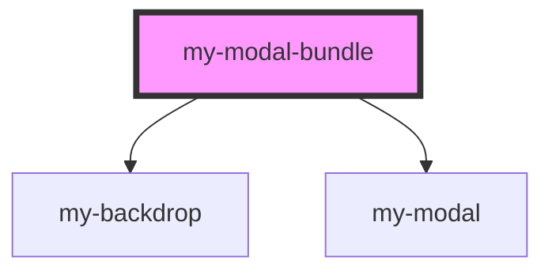

# my-modal-bundle

<!-- Auto Generated Below -->

## Properties

| Property  | Attribute | Description | Type     | Default     |
| --------- | --------- | ----------- | -------- | ----------- |
| `content` | `content` |             | `string` | `undefined` |
| `titles`  | `titles`  |             | `string` | `undefined` |

## Methods

### `open() => Promise<void>`

#### Returns

Type: `Promise<void>`

## Dependencies

### Depends on

- [my-backdrop](../my-backdrop)
- [my-modal](../my-modal)

### Graph

----------------------------------------------

*Built with [StencilJS](https://stenciljs.com/)*
